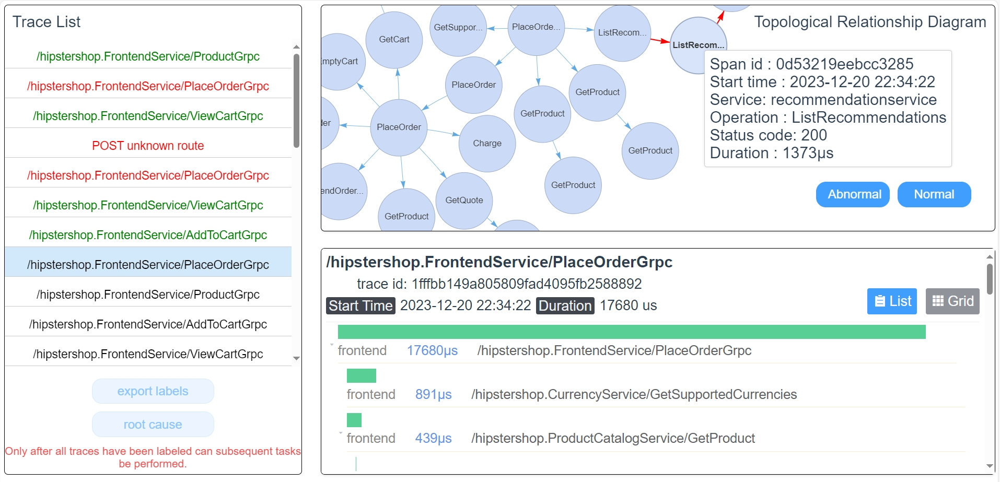

# LabelEase

> Implementation and datasets for ISSRE2024 TAR paper 'LabelEase: A Semi-Automatic Tool for Efficient and Accurate Trace Labeling in Microservices'.


## Artifact Description

### code

- **Frontend Code**: Files for the front-end application located in the `frontend/` folder.
- **Backend Code**: Algorithm and back-end code located in the `backend/` folder.

### dataset

We provide a trace anomaly detection dataset in 

```shell
./backend/LabelEase/data/data1.zip
```


## Environment Setup

All experiments are run on a server with two 16C32T Intel(R) Xeon(R) Gold 5218 CPU @ 2.30 GHz, one NVIDIA(R) Tesla(R) V100S, and 192 GB RAM.

The implementation of LabelEase is in Python 3.7.0, with PyTorch 1.5.0 serving as the primary deep learning framework.

A list of required Python libraries is located in the `.\backend\LabelEase\requirements.txt`.

```shell
cd .\backend\
pip install -r .\requirements.txt
```

We also provide a Docker image for the backend to streamline the installation process. To utilize it, simply mount the project directory to the working environment and map the necessary ports. You can then build and run the Docker container using the provided image. For instance:

```
docker run -it -p 8000:8000 -v <项目绝对路径>:/app  镜像名  /bin/bash
```

In addition, the artifact requires automatic downloading of model weights. However, under poor network conditions, the download may be slow or fail. To address this, we have provided the relevant model weights folder, **bert-base-uncased**, which should be placed in the following directory: `./backend/LabelEase`.

The docker image and model weights can be accessed via the following link: https://fc0a3d4407.znas.cn/AppH5/share/?nid=LIYDEMRQGA2DERCFJVLU2&code=dtIE3CeEfyD0m1YMFjm1kJjpLVGVSqm2Vn2pE6146rm1qm3vdDs3jo9e6XO0wIKlMigUu&mode=file&display=list

## Getting Started

### start quickly

> Ensure that MySQL is installed on the host or server and that the MySQL service is running successfully. Additionally, update the MySQL configuration details in the `./backend/backend/settings.py` file.
>
> If you are using the provided Docker image, you can set the `HOST` parameter to `host.docker.internal` to connect to the MySQL service running on the host machine. For instance:
>
> ```
> DATABASES = {
>  'default': {
>      'ENGINE': 'django.db.backends.mysql',
>      'NAME': 'rcltool',
>      'USER': 'xxx',
>      'PASSWORD': 'xxx',
>      # 'HOST': 'localhost',
>      'HOST': 'host.docker.internal',
>      'PORT': '3306',
>  }
> }
> 
> ```

```shell
cd .\backend\LabelEase\
python run.py
```

### backend

```shell
cd .\backend\
python manage.py makemigrations
python manage.py migrate
python manage.py runserver
python manage.py runserver 0.0.0.0:8000 # When using docker container
```

### frontend

```shell
cd .\frontend\
npm install
npm run dev
```


## Reproducibility Instructions

**Initialize Environment**:

- Make sure all dependencies are installed, and the backend and frontend are correctly configured.

**Run Experiments**:

- Execute the backend server and load the frontend application as specified. Perform trace labeling using the provided tools.

**Validate Results**:

- Compare your results with those reported in the paper to confirm that the tool produces the same outcomes.

By these instructions being followed, the trace labeling results should be reproducible and the claims made in the paper can be verified.


## instructions for trace annotation




We have seamlessly integrated the LabelEase approach into a bespoke labeling tool. The two images above show the interfaces for trace anomalies labeling and  root cause labeling respectively.

In the trace list displayed on the left side of the first page, each trace is visually distinguished: green signifies a label of  "normal", red indicates a label of "abnormal", and black denotes traces awaiting labeling.  Operators can label each trace by selecting either the "abnormal" or "normal" buttons, guided by structural information at the top right and delay information at the bottom right of the page.

A microservice system relationship diagram is featured prominently in the center of the second  page. The higher the suspicious score, the more likely the root cause is, and the darker the service will be displayed on the interface. Upon selecting a service, detailed information about it is displayed in the right box. Operators can set the type of fault to label the root cause. Then, the service labeled as the root cause is highlighted in red. Eventually, the dataset's ground truth can be exported, and this high-quality trace dataset can be used for other scientific tasks.
